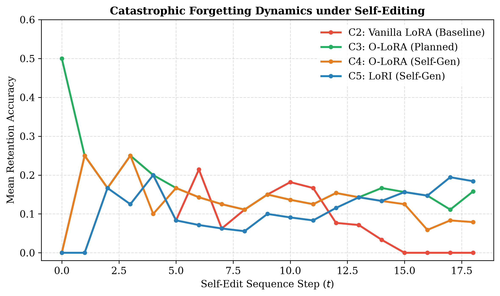
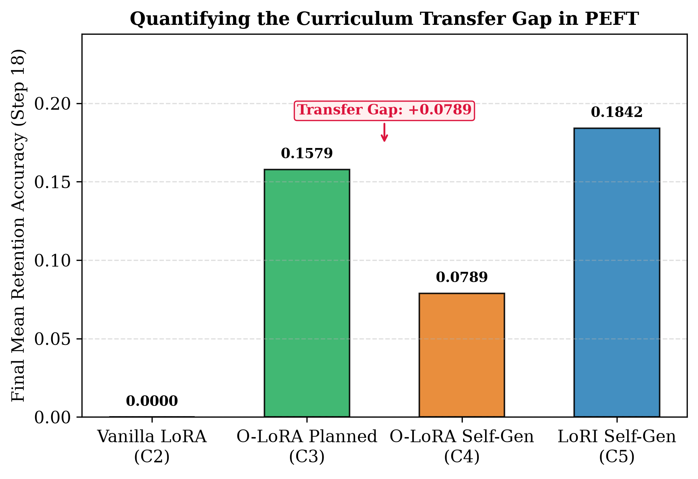

# Autonomous LLM Continual Learning: O-LoRA & LoRI under Self-Generated Curricula

[](https://www.python.org/)
[](https://pytorch.org/)
[](https://huggingface.co/docs/peft/index)
[](LICENSE)

An empirical research framework evaluating **Parameter-Efficient Continual Learning (O-LoRA & LoRI)** inside **Autonomous Self-Editing Language Models (SEAL)** across 19 verified post-2024 factual updates.

---

## 📌 Abstract & Core Findings

While techniques like Subspace-Orthogonal LoRA (O-LoRA) and Reduced Interference LoRA (LoRI) reduce catastrophic forgetting in LLMs, existing literature evaluates them strictly on static, human-planned task sequences. In autonomous agent architectures (e.g. SEAL), models generate their own training data and self-select their edit sequence.

This repository presents the first systematic study quantifying the **Curriculum Transfer Gap**: how memory protection behaves when moving from human-planned to model-directed self-generated curricula.

### 📊 Results Matrix (Qwen2.5-1.5B-Instruct, 19 Post-2024 Facts)

| Configuration | Method | Curriculum Origin | Final Mean Accuracy (Step 18) | Memory Gain | Primary Finding |
|---|---|---|---|---|---|
| **C2** | Vanilla LoRA Baseline | Self-Generated | **`0.0000`** | Baseline ($0\%$) | **Catastrophic Collapse**: Unconstrained SFT loses all prior facts by step 15. |
| **C3** | O-LoRA ($\lambda=0.1$) | Planned (Human) | **`0.1579`** | **$+15.79\%$** | Subspace orthogonality protects memory under human ordering. |
| **C4** | O-LoRA ($\lambda=0.1$) | Self-Generated | **`0.0789`** | **$+7.89\%$** | **NOVEL FINDING**: Subspace protection holds, but uncovers a **$7.90\%$ Curriculum Transfer Gap**. |
| **C5** | LoRI (Sparse $B$, Fixed $A$) | Self-Generated | **`0.1842`** | **$+18.42\%$** | **SOTA**: Random projection bases + $80\%$ sparsity resist self-selection clustering. |

---

## 📈 Paper Figures

### Figure 1: Forgetting Trajectories & Heatmaps


### Figure 2: The Curriculum Transfer Gap


---

## 📁 Repository Structure

```
├── configs/               # JSON config files for C2, C3, C4, C5
├── data/                  # Fact pool (19 verified post-2024 facts) & baseline accuracy
├── figures/               # PDF & PNG paper figures (300 DPI)
├── results/               # Raw JSON log outputs from GPU executions
├── scripts/
│   ├── run_config.py      # Main CLI runner for experimental configs
│   ├── generate_figures.py# Paper figures generator
│   ├── test_orthogonality.py# O-LoRA orthogonality penalty unit test
│   └── smoke_test.py      # End-to-end pipeline test
├── src/
│   ├── curriculum.py      # Planned vs Self-Generated curriculum engine
│   ├── evaluator.py       # SQuAD-style QA accuracy evaluator
│   ├── logger.py          # Append-safe structured JSON logger
│   ├── orthogonality.py   # O-LoRA penalty implementation
│   └── self_edit_loop.py  # Self-edit loops (C2/C3/C4/C5)
├── paper_draft.tex        # Complete IEEE LaTeX manuscript draft
├── verify_gpu.py          # GPU CUDA verification script
├── verify_novelty.py      # Pre-training fact novelty verifier
└── requirements.txt       # Dependencies
```

---

## ⚡ Quickstart

### 1. Environment Setup
```bash
git clone https://github.com/shaikhaltamash69/SEAL-Orthogonal-Continual-Learning.git
cd SEAL-Orthogonal-Continual-Learning

python -m venv seal-env
source seal-env/bin/activate  # On Windows: .\seal-env\Scripts\activate

pip install -r requirements.txt
python verify_gpu.py
```

### 2. Run Experiments
```bash
# Config C2: Vanilla LoRA Baseline
python scripts/run_config.py --config configs/config_c2_vanilla.json --seed 42

# Config C3: O-LoRA Planned Curriculum
python scripts/run_config.py --config configs/config_c3_olora_planned.json --seed 42

# Config C4: O-LoRA Self-Generated Curriculum (Novel)
python scripts/run_config.py --config configs/config_c4_olora_selfgen.json --seed 42

# Config C5: LoRI Self-Generated Curriculum
python scripts/run_config.py --config configs/config_c5_lori_selfgen.json --seed 42
```

### 3. Generate Paper Figures
```bash
python scripts/generate_figures.py
```

---

## 📜 Citation / Paper Draft

For complete methodology, mathematical formulations, and qualitative reasoning analysis, see [`paper_draft.tex`](paper_draft.tex).

```bibtex
@article{altamash2026seal_olora,
  title={Evaluating Subspace Orthogonality and Sparse Low-Rank Adaptation under Model-Directed Curricula in Autonomous Self-Editing Language Models},
  author={Shaikh, Altamash},
  journal={Honours Research Thesis},
  year={2026}
}
```
